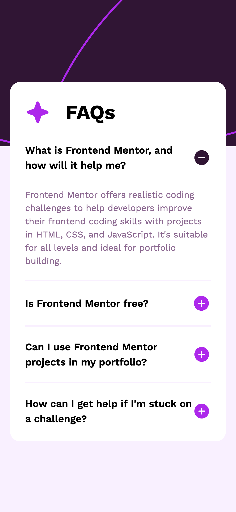

# Frontend Mentor - FAQ accordion solution

This is a solution to the [FAQ accordion challenge on Frontend Mentor](https://www.frontendmentor.io/challenges/faq-accordion-wyfFdeBwBz). Frontend Mentor challenges help you improve your coding skills by building realistic projects.

## Table of contents

- [Overview](#overview)
  - [The challenge](#the-challenge)
  - [Screenshot](#screenshot)
  - [Links](#links)
- [My process](#my-process)
  - [Built with](#built-with)
  - [What I learned](#what-i-learned)
  - [Continued development](#continued-development)
  - [Useful resources](#useful-resources)
- [Author](#author)

## Overview

### The challenge

Users should be able to:

- Hide/Show the answer to a question when the question is clicked
- Navigate the questions and hide/show answers using keyboard navigation alone
- View the optimal layout for the interface depending on their device's screen size
- See hover and focus states for all interactive elements on the page

### Screenshot



### Links

- Solution URL: [Faq accordion solution](https://www.frontendmentor.io/solutions/faq-accordion-F7WrgkOtcd)
- Live Site URL: [Faq accordion live](https://faq-accordion-component-topaz.vercel.app/)

## My process

### Built with

- Semantic HTML5 markup
- CSS custom properties
- Flexbox
- Mobile-first workflow

### What I learned

```js
let setDefault = () => {
	for (let index = 0; index < active.length; index++) {
		active[index].style.display = "none";
		// set the image location source
		let imageId = active[index].previousElementSibling.lastElementChild;
		imageId.src = "../assets/images/icon-plus.svg";
	}
};
```

### Continued development

- Responsive design
- JS functions

### Useful resources

- [How TO - Style HR (Horizontal Ruler/Line)](https://www.w3schools.com/howto/howto_css_style_hr.asp) - The example helped me to understand how to apply border to horizontal line.

- [Display Property](https://css-tricks.com/almanac/properties/d/display/) - This is great article explain how various values of dislay works.

- [JavaScript Siblings](https://www.javascripttutorial.net/javascript-dom/javascript-siblings/) - The article explains how javascript siblings works with examples.

## Author

- Frontend Mentor - [@mayor-creator](https://www.frontendmentor.io/profile/mayor-creator)
- Threads - [@mayor_creator](https://www.threads.net/@mayor_creator)
